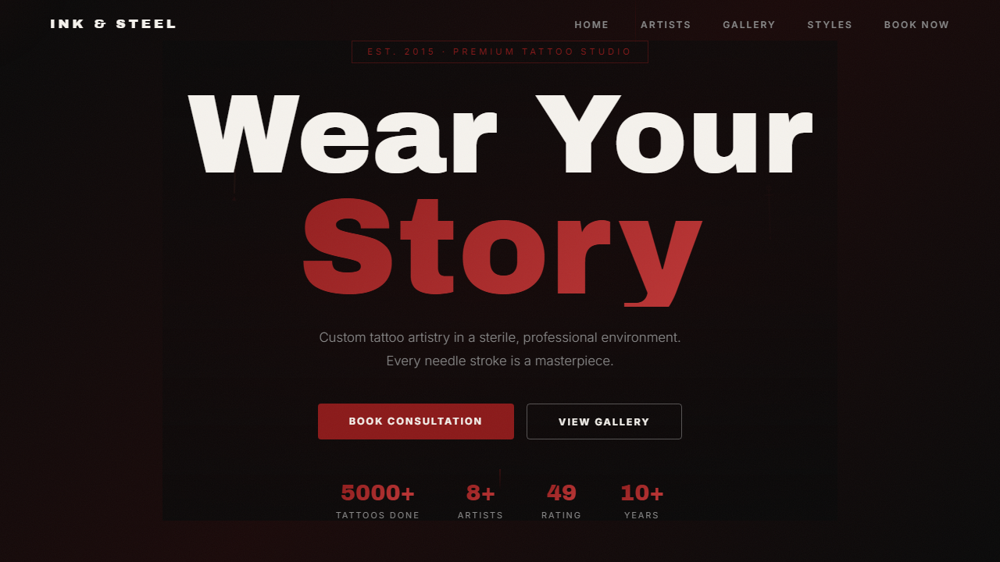

<div align="center">

<!-- BRAND HEADER -->
<picture>
  <source media="(prefers-color-scheme: dark)" srcset="https://readme-typing-svg.demolab.com?font=Archivo+Black&size=42&pause=1000&color=CF4646&center=true&vCenter=true&repeat=false&width=600&height=70&lines=INK+%26+STEEL">
  
</picture>

<br/>

**Premium tattoo studio landing page — dark, bold, and immersive.**  
*Brooklyn's finest custom tattoo artistry.*

<br/>

[](https://powerisvansh.github.io/Tatto/)
&nbsp;
[](https://github.com/Powerisvansh/Tatto)

<br/>



</div>

---

## ✦ Features

| | |
|---|---|
| 🎨 **Dark Industrial Design** | Custom palette, noise texture, red/gold accents |
| 🖱️ **Custom Cursor** | Smooth lerp-based radial glow following the mouse |
| 🎞️ **Parallax Scrolling** | Multi-layer with per-element speed control |
| 🖼️ **Lightbox Gallery** | Full-screen modal with keyboard navigation |
| 📱 **Responsive** | 4 breakpoints from 4K down to 480px |
| 🔢 **Animated Counters** | IntersectionObserver-triggered stats |
| 🎭 **Scroll Reveals** | Staggered fade-in animations on scroll |
| 🏷️ **Infinite Marquee** | Horizontal scrolling ticker of tattoo styles |
| 🔥 **Mobile Hamburger** | Slide-in nav with animated hamburger-to-close |
| ⬆️ **Back to Top** | Floating button after scrolling past hero |
| ⌛ **Loading Screen** | Animated spinner + brand reveal on page load |
| 📊 **Scroll Progress Bar** | Top-of-page progress indicator synced to scroll |
| 🎬 **Hero Animations** | Zoom, ink drip SVGs, tattoo machine needle stroke |
| 🌫️ **Noise Texture** | SVG fractal noise overlay across entire page |
| 📝 **Booking Form** | Client-side validation with live per-field feedback |
| ♿ **Accessible** | ARIA labels, roles, keyboard navigation, semantic HTML |

---

## ✦ Tech Stack

```
📄 HTML5   → Semantic, Open Graph, ARIA landmarks
🎨 CSS3    → Custom properties, Grid/Flexbox, keyframe animations, responsive
⚡  JS      → Vanilla ES6+ — IntersectionObserver, DOM, form validation
🔤 Fonts   → Archivo Black (headings) · Inter (body)
🎨 Icons   → Inline SVGs · HTML entities
🖼️ Media   → Unsplash / Pexels stock photography
```

---

## ✦ Sections & Structure

| # | Section | Highlights |
|:---:|---|---|
| 1 | **Loader** | Animated spinner + brand reveal on load |
| 2 | **Hero** | Parallax bg, tattoo machine SVG, ink drips, CTAs |
| 3 | **Marquee** | Endless ticker of tattoo styles |
| 4 | **Artists** | 4 artist cards with tags |
| 5 | **Gallery** | 16-piece grid with hover zoom + lightbox |
| 6 | **Styles** | 6 style cards with SVG icons |
| 7 | **Booking** | Validated form + contact info |
| 8 | **Aftercare** | 4 healing tips |
| 9 | **Quote** | Blockquote with decorative flourishes |
| 10 | **Footer** | Socials, contact, copyright |

---

## ✦ Getting Started

```bash
git clone https://github.com/Powerisvansh/Tatto.git
cd Tatto
start index.html
```

No build step needed — open `index.html` in any browser.

---

```
Tatto/
├── index.html       # 10 sections, inline SVGs, ARIA
├── style.css        # 714 lines — custom props, Grid/Flexbox, animations
├── script.js        # 258 lines — cursor, parallax, lightbox, form validation
└── README.md
```

---

## ✦ License

**MIT** — free to use, modify, and distribute.

<br/>

<div align="center">

Crafted with ❤️ and a lot of ink.  
© 2026 — [Powerisvansh](https://github.com/Powerisvansh)

<br/>

[](https://github.com/Powerisvansh)
&nbsp;
[](https://powerisvansh.github.io/Tatto/)

</div>
